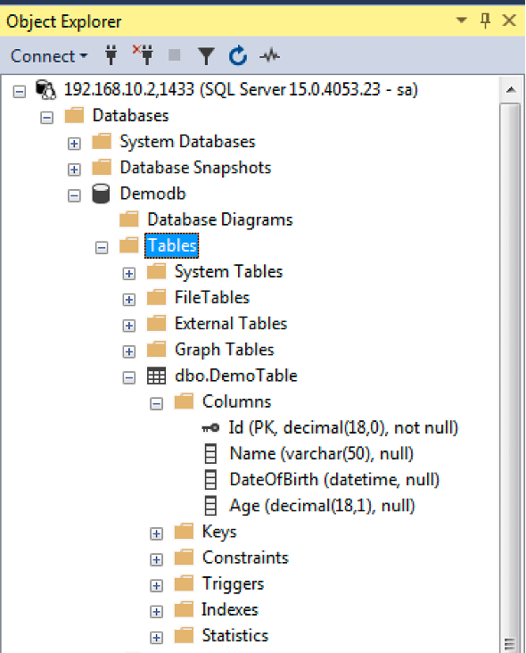
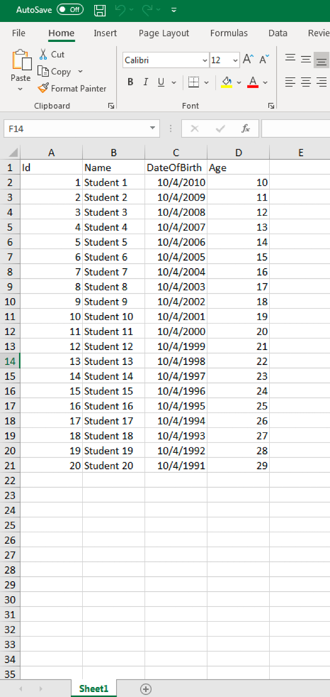
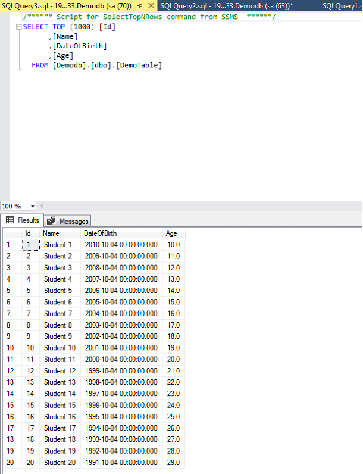

# **Bulk copy Excel data to MS SQL Server Database**

The [free consulting projects](https://aspose-free-consulting.github.io/) are designed to help users to understand the usage of certain features in detail with examples. This project assists users to extract bulk data from an Excel file and save it in a MS SQL database table.

## **System Requirements and Notes**

**Set up Modules and Environment**

We need to establish the environment where MS SQL Server is installed and the database is available having a table where data is to be copied from an Excel file. If you do not have Microsoft SQL server installed in your environment, you may consider running SQL Server container image with Docker with the help of following article:

[Run SQL Server container images with Docker](https://docs.microsoft.com/en-us/sql/linux/quickstart-install-connect-docker?view=sql-server-ver15&pivots=cs1-bash)

Once the MS SQL Server is ready, a database is to be created. You may create this database using Microsoft SQL Server Management Studio. In this project we used database name “Demodb” and table name is DemoTable.

- **Create Database**

If Microsoft SQL Server Management Studio is not available, then use following script to create the database:

    CREATE DATABASE [Demodb]
    
    CONTAINMENT = NONE
    
    ON  PRIMARY 
    
    ( NAME = N'Demodb', FILENAME = N'/Demodb.mdf' , SIZE = 8192KB , MAXSIZE = UNLIMITED, FILEGROWTH = 65536KB )
    
    LOG ON 
    
    ( NAME = N'Demodb\_log', FILENAME = N'/Demodb\_log.ldf' , SIZE = 8192KB , MAXSIZE = 2048GB , FILEGROWTH = 65536KB )
    
    WITH CATALOG\_COLLATION = DATABASE\_DEFAULT

- **Create Table**

Run following script to create a table which will be used in our sample project.

    CREATE TABLE [dbo].[DemoTable](
    
    [Id] [decimal](18, 0) NOT NULL,
    
    [Name] [varchar](50) NULL,
    
    [DateOfBirth] [datetime] NULL,
    
    [Age] [decimal](18, 1) NULL,
    
    CONSTRAINT [PK\_DemoTable] PRIMARY KEY CLUSTERED 
    
    (
    
    [Id] ASC
    
    )WITH (PAD\_INDEX = OFF, STATISTICS\_NORECOMPUTE = OFF, IGNORE\_DUP\_KEY = OFF, ALLOW\_ROW\_LOCKS = ON, ALLOW\_PAGE\_LOCKS = ON) ON [PRIMARY]
    
    ) ON [PRIMARY]
    
    GO

- **User name and password**

For simplicity we are using “sa” user whose password is “Passw0rd”

- **Sample Excel File**

A sample Excel file “Sample.xlsx” is part of this demo project which contains dummy data that is to be copied to database. This Excel file contains following 4 columns:

- Id
- Name
- DateOfBirth
- Age

## **The Demo**

- This demo project is a simple console based application
- First it will open the database where connection string is to be provided by the user. Following information of server is required in this connection string:
  - Microsoft SQL Server IP and port
  - Catalog name (“Demodb” in our demo project)
- Once the database is connected, create SqlBulkCopy object with the connection string and setting the destination table name
- Next mapping is to be provided between the source columns and destination columns.
- Aspose.Cells will be used to open the sample Excel file and export data into  DataTable object.
- Use this DataTable object in the SqlBulkCopy object to write data to server.
- At the end connection to the database is closed

**How to Run the Demo**

- As this is simple console application, therefore after setting the database and required table, we just need to run the project.
- It will copy the data from Excel to the database server.
- Open the table using Microsoft SQL Management Server Studio and check the newly inserted records.

## **Screenshots**

- Make sure that after running the script following database and table is created.

- Following shall be data in sample Excel file for testing:

- After running the program following shall be the table data

